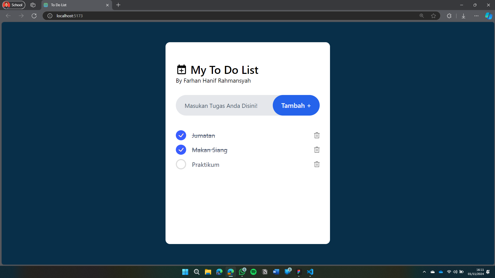

### Tugas Pengembangan Web_Farhan Hanif Rahmansyah_21060122120002

# Deskripsi
Proyek ini adalah aplikasi To-Do List sederhana yang dibangun menggunakan teknologi berikut:
- **React**: Library untuk membangun antarmuka pengguna.
- **Vite**: Build tool dan development server.
- **JavaScript (ES6+)**: Bahasa pemrograman yang digunakan.
- **Tailwind CSS**: Framework CSS utility-first untuk styling.
- **Local Storage**: Penyimpanan data di browser.

# Struktur Proyek
- index.html: File HTML utama yang memuat aplikasi React. Ini juga mengatur favicon dan title halaman.
- App.jsx: Komponen utama aplikasi yang merender komponen ToDo.
- ToDo.jsx: Komponen yang mengelola daftar To-Do. Ini mencakup logika untuk menambah, menghapus, dan menandai To-Do sebagai selesai.
- ToDoItems.jsx: Komponen yang merender item individu dalam daftar To-Do.
- assets: Direktori yang menyimpan aset seperti gambar ikon.

# Fungsionalitas Utama
- Menambah To-Do: Pengguna dapat menambahkan item baru ke daftar To-Do dengan mengetikkan teks dan mengklik tombol "Tambah".
- Menandai Selesai: Pengguna dapat menandai item sebagai selesai dengan mengklik item tersebut. Item yang selesai akan diberi garis tengah.
- Menghapus To-Do: Pengguna dapat menghapus item dari daftar dengan mengklik ikon hapus.
Penyimpanan Lokal: Daftar To-Do disimpan di local storage sehingga data tetap ada meskipun halaman di-refresh.

# Screenshot

# React + Vite

This template provides a minimal setup to get React working in Vite with HMR and some ESLint rules.

Currently, two official plugins are available:

- [@vitejs/plugin-react](https://github.com/vitejs/vite-plugin-react/blob/main/packages/plugin-react/README.md) uses [Babel](https://babeljs.io/) for Fast Refresh
- [@vitejs/plugin-react-swc](https://github.com/vitejs/vite-plugin-react-swc) uses [SWC](https://swc.rs/) for Fast Refresh
